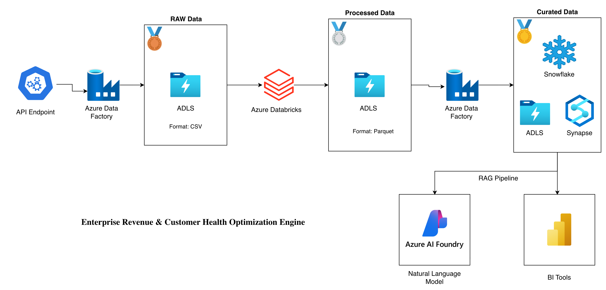
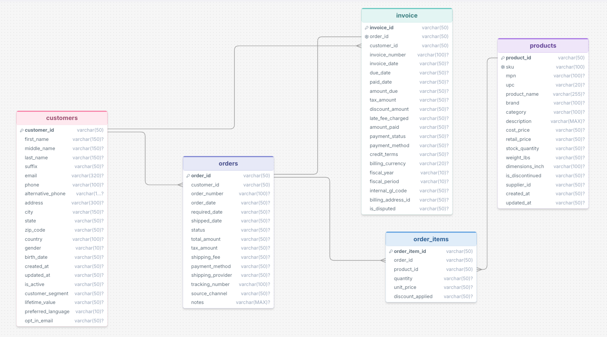
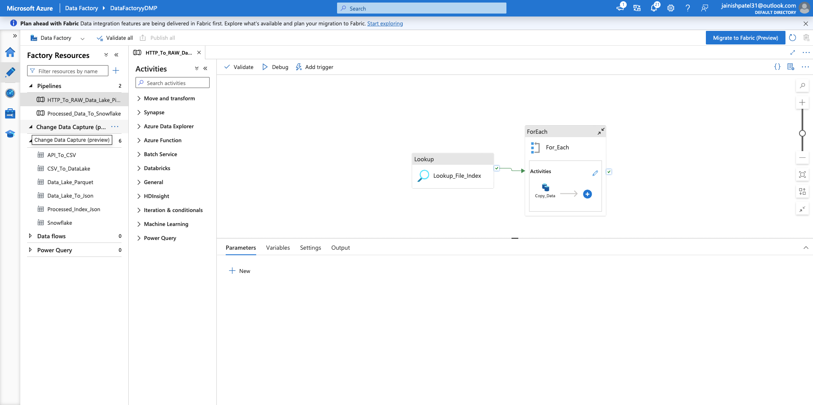
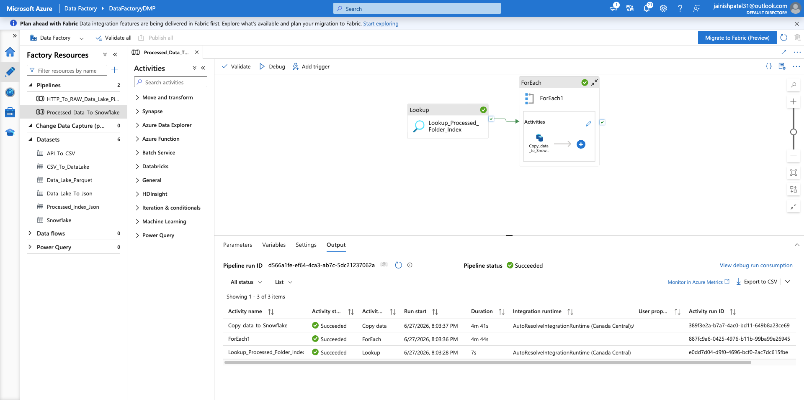
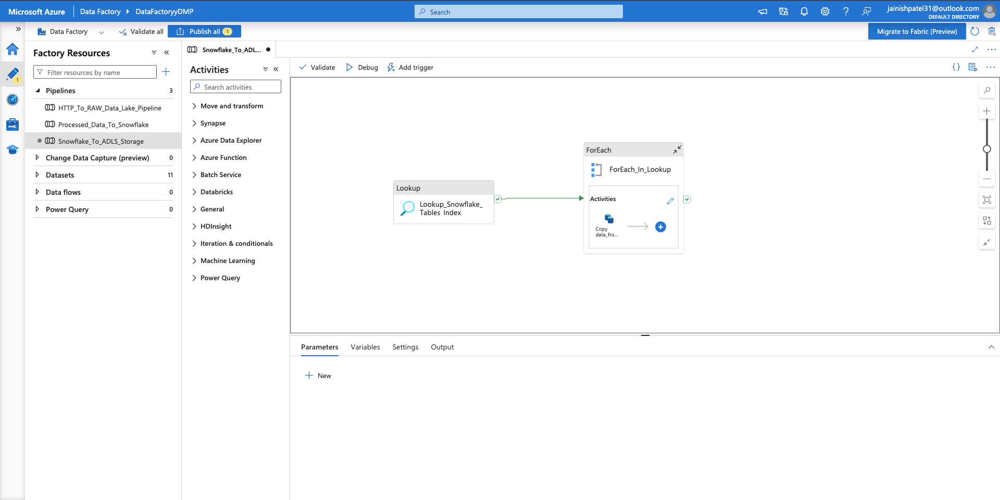
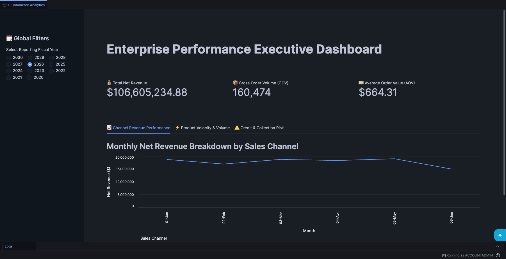

# Enterprise Revenue & Customer Health Optimization Engine

A comprehensive enterprise data platform for e-commerce analytics and customer health optimization. This project generates, processes, and analyzes large-scale transactional data using a modern **Medallion Architecture** spanning containerized databases, cloud data lakes, and advanced analytics platforms.

## 📋 Project Overview

This enterprise-grade system generates, manages, and analyzes over **4.5 million records** across interconnected e-commerce entities (Customers, Orders, Invoices, Products, Order Items). It provides end-to-end data engineering from local SQL Server source systems through cloud transformation and analytics pipelines.

**Key Capabilities:**

- 🗄️ **Mock Data Generation:** Realistic e-commerce transactional data with 500K+ customer records
- 🔄 **ETL/ELT Pipelines:** Azure Data Factory orchestration with multi-stage transformations
- 🏗️ **Medallion Architecture:** Bronze (Raw), Silver (Transformed), Gold (Aggregated) data layers
- 📊 **Analytics & BI:** Snowflake data warehousing and Power BI reporting
- 🤖 **AI Chatbot:** RAG-powered chatbot for business intelligence queries
- ☁️ **Cloud Integration:** Azure Databricks, Snowflake, Azure Data Lake, Azure Data Factory

---

## 📁 Project Architecture Diagram



---

## 🏗 Medallion Architecture

```
┌─────────────────────────────────────────────────────────────────┐
│               Enterprise Data Platform                          │
├─────────────────────────────────────────────────────────────────┤
│ DATA SOURCE: Web Source                                         │
│    • Customers | Orders | Invoices | Products | Order Items     │
└─────────────────┬───────────────────────────────────────────────┘
                  │
                  ▼ (via Azure Data Factory Pipelines)
┌─────────────────────────────────────────────────────────────────┐
│ BRONZE LAYER: Azure Data Lake Storage (Raw Data)                │
│    • CSV exports from source tables                             │
│    • Unmodified, unfiltered records                             │
│    • CSV chunks for parallel processing                         │
└─────────────────┬───────────────────────────────────────────────┘
                  │
                  ▼ (via Azure Data Factory Pipelines)
┌─────────────────────────────────────────────────────────────────┐
│ SILVER LAYER: Databricks (Processed Data) (PySpark)             │
│    • Data cleansing & enrichment                                │
│    • Type coercion & normalization                              │
│    • Business logic application                                 │
│    • Databricks Spark notebook processing                       │
└─────────────────┬───────────────────────────────────────────────┘
                  │
                  ▼ (via Azure Data Factory Pipelines)
┌─────────────────────────────────────────────────────────────────┐
│ GOLD LAYER: Snowflake Core (Analytics Ready)                    │
│    • Business aggregations                                      │
│    • Customer metrics & KPIs                                    │
│    • Revenue optimization models                                │
│    • Dynamic views for reporting                                │
└─────────────────┬───────────────────────────────────────────────┘
                  │
                  ▼
┌─────────────────────────────────────────────────────────────────┐
│ REPORTING: Power BI Dashboards + RAG Chatbot                    |
│    • Executive dashboards                                       │
│    • Real-time customer health metrics                          │
│    • Revenue optimization insights                              │
│    • AI-powered query interface                                 │
└─────────────────────────────────────────────────────────────────┘
```

---

## 🔑 Key Components

### Data Generators

- **customer_data_generator.py** - Creates 500K+ customer records with demographic details
- **product_data_generator.py** - Generates product catalog with SKUs, pricing, inventory
- **order_data_generator.py** - Creates orders with realistic relationships to customers
- **invoice_data_generator.py** - Generates 1.2M+ invoice records with financial details

### Database Schema

Core tables in MS SQL Server:

- **customers** - Customer master (customer_id, email, address, etc.)
- **products** - Product catalog (product_id, sku, pricing)
- **orders** - Order header (order_id, customer_id, total_amount)
- **order_items** - Order line items (order_item_id, order_id, product_id, quantity)
- **invoice** - Invoice records (invoice_id, order_id, amount_due, payment_status)

**Relationships:**



### Azure Data Factory Pipelines

1. **HTTP_To_RAW_Data_Lake_Pipeline.json**
   - Ingests HTTP data sources to Azure Data Lake
   - Bronze layer population
   - Lookup activity for file indexing

   

2. **Processed_Data_To_Snowflake.json**
   - Transforms processed data to Snowflake
   - Silver to Gold layer transition

   

3. **Snowflake_To_ADLS_Storage.json**
   - Back-syncs aggregated data to Azure Data Lake

   

### Databricks Spark Notebooks

- **Customer Data Cleaning.ipynb** - Customer data validation and enrichment
- **Orders Data Cleaning.ipynb** - Order transaction cleaning
- **Invoices Data Cleaning.ipynb** - Invoice validation and reconciliation
- **Products Data Cleaning.ipynb** - Product master data cleansing
- **Order_Items Data Cleaning.ipynb** - Line-item detail processing

### Snowflake Notebooks

- **Data_Transformation.ipynb** - Complex transformations and aggregations
- **Dynamic_Table_Views.ipynb** - Real-time view creation
- **Customer_Churn_Prediction.ipynb** - Predictive analytics for churn
- **streamlit_app.py** - Streamlit dashboard for visualizing KPIs and metrics

### RAG Chatbot

- **chat_bot.py** - Azure AI-powered chatbot for business queries
- Integrated with project client credentials
- Real-time Q&A interface for dashboards

---

## 📊 Data Specifications

[E-commerce_Data](https://github.com/polonium31/E-commerce_Data)

### Data Volume

| Entity      | Record Count | CSV Chunks | Avg Chunk Size |
| ----------- | ------------ | ---------- | -------------- |
| Customers   | ~500,000     | 18         | ~27,000        |
| Invoices    | ~1,000,000   | 34         | ~36,000        |
| Orders      | ~1,000,000   | 35         | ~25,000        |
| Order Items | ~2,000,280   | 68         | ~25,000        |
| Products    | ~50,000      | 2          | ~20,000        |

### Data Characteristics

- **Realistic Distribution:** Faker library generates authentic customer names, emails, addresses
- **Temporal Aspects:** Date ranges span 2-3 years with realistic business patterns
- **Geographic Diversity:** Multi-country, multi-state distribution
- **Business Logic:** Cross-table relationships maintain referential integrity

---

## 🔍 Data Quality & Validation

The `data_analysis.sql` file includes validation checks:

- **Foreign Key Constraints:** Enforces relationships between tables
- **Unique Constraints:** Ensures no duplicate invoices per order
- **Reconciliation Logic:** Validates order totals against line items
- **Cross-table Integrity:** Confirms customer IDs match across orders and invoices

---

## ☁️ Cloud Integration

### Azure Data Lake Storage (Bronze Layer)

- Stores CSV exports from MS SQL Server
- Path structure: `/data/raw/{table_name}/{chunks}`
- Supports parallel ingestion

### Azure Data Factory

- Orchestrates multi-stage pipelines
- Triggers scheduled data ingestion
- Monitors pipeline runs and failures

### Snowflake (Silver & Gold Layers)

- Stages cleaned data (Silver)
- Hosts aggregated analytics (Gold)
- Provides time-travel capabilities
- Integrates with Power BI

### Azure Databricks

- Runs PySpark cleaning notebooks
- Processes terabyte-scale datasets
- Provides ML capabilities

## 📊 Dashboard



## 🤖 AI Features

### RAG Chatbot (chat_bot.py)

```python
# Example: Query customer health metrics
Question: "What's the customer churn rate for Q3?"
Response: (AI-generated from Snowflake analytics layer)
```

**Features:**

- Uses Azure AI Projects Client
- Connected to Snowflake data
- Provides natural language queries on structured data

---

## 📈 Use Cases

1. **Revenue Optimization**
   - Customer lifetime value predictions
   - Order value forecasting
   - Invoice aging analysis

2. **Customer Health Monitoring**
   - Churn risk detection
   - Engagement scoring
   - Segment analysis

3. **Operational Analytics**
   - Order fulfillment metrics
   - Inventory optimization
   - Supplier performance

4. **Financial Analytics**
   - Invoice reconciliation
   - Payment analysis
   - Discount optimization

---

## 🔐 Security Notes

⚠️ **This is a development/demo project.** In production:

- Use Azure Key Vault for credential management
- Implement network segmentation
- Enable encryption at rest and in transit
- Use managed identities instead of hardcoded credentials
- Apply principle of least privilege for database roles

---

## 📚 Additional Resources

- [Azure Data Factory Documentation](https://learn.microsoft.com/en-us/azure/data-factory/)
- [Snowflake SQL Reference](https://docs.snowflake.com/)
- [Databricks Apache Spark Guide](https://docs.databricks.com/)
- [Faker Python Library](https://faker.readthedocs.io/)
- [pyodbc Documentation](https://github.com/mkleehammer/pyodbc)

---

## 📄 License

This project is provided as-is for educational and enterprise analytics purposes.

**Last Updated:** 2026-07-08
