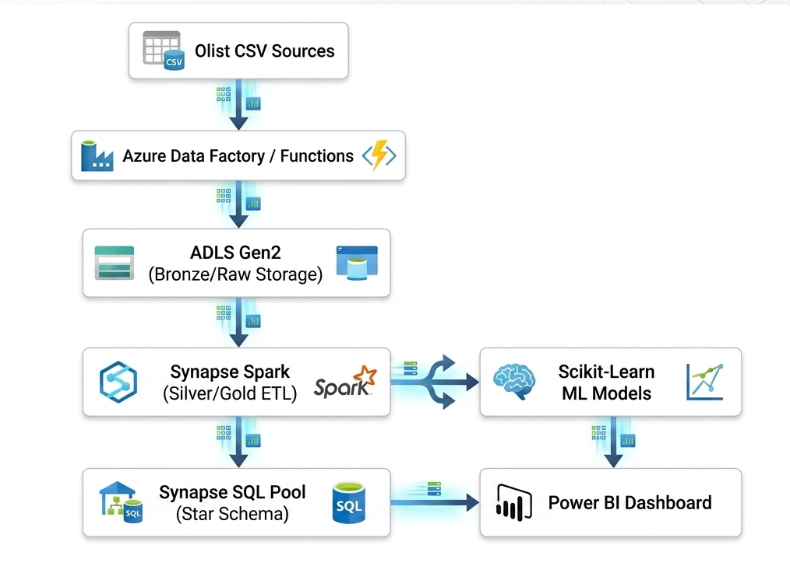

# Enterprise Revenue & Customer Health Optimization Engine

An end-to-end cloud data engineering and advanced analytics platform built on **Microsoft Azure**. This enterprise solution addresses uncoordinated regional pricing and customer churn for B2B SaaS/E-commerce environments by processing millions of operational records into actionable executive insights.

---

## 🏢 Business Architecture

This engine solves three critical executive bottlenecks:

1. **Predictive Churn Modeling:** Identifying high-risk customer segments before revenue drop-off.
2. **Price Elasticity Engine:** Quantifying how regional price changes impact product demand.
3. **CLV-Driven Marketing Optimization:** Aligning acquisition and retention spend based on long-term Customer Lifetime Value (CLV).

---

## 🛠️ Tech Stack & Architecture

The architecture leverage a scalable Azure data ecosystem, moving from raw event ingestion to ML modeling and executive semantic layers.

- **Data Ingestion & Orchestration:** Azure Functions & Azure Data Factory (ADF)
- **Data Lakehouse Storage:** Azure Blob Storage / Data Lake Storage (ADLS Gen2)
- **Distributed Compute & ETL:** Azure Synapse Analytics (PySpark)
- **Data Warehousing (Star Schema):** Azure Synapse Dedicated SQL Pools
- **Analytics & Machine Learning:** Python (Pandas, Scikit-learn, Statsmodels)
- **Business Intelligence:** Power BI

### Data Pipeline Flow



## 📐 Data Warehouse Modeling (Star Schema)

Data is transformed from fragmented transactional logs into a highly optimized Star Schema within Azure Synapse to power fast BI querying and clean data structures for ML training.

### Fact Tables

- `fact_sales_transactions` – Tracks line-item revenue, regional pricing, and quantities.
- `fact_customer_snapshots` – Weekly/monthly aggregations of customer engagement and usage metrics.

### Dimension Tables

- `dim_customers` – Customer profiles, segments, firmographics, and tenure.
- `dim_products` – Product catalog, tiering, and regional base pricing.
- `dim_geography` – Regional branches, currencies, and market classifications.
- `dim_date` – Enterprise fiscal calendar for time-series trend analysis.

---

## 📁 Repository Structure

```text
├── .github/                     # CI/CD Workflows (Azure DevOps / GitHub Actions)
├── assets/                     # images, diagrams, and mock data samples for documentation
├── azure-pipelines/             # Infrastructure as Code (ARM/Bicep templates)
├── src/
│   ├── ingestion/               # Azure Functions & ADF pipeline configurations
│   ├── transform/               # Synapse PySpark notebooks for Bronze/Silver/Gold processing
│   ├── modeling/                # Python scripts for Churn, Elasticity, and CLV models
│   └── warehouse/               # DDL/DML scripts for Synapse SQL Star Schema
├── dashboards/                  # Power BI templates (.pbit) and mock screenshot assets
├── tests/                       # PyTest suites for data validation and pipeline unit tests
├── requirements.txt             # Python dependencies
└── README.md
```
